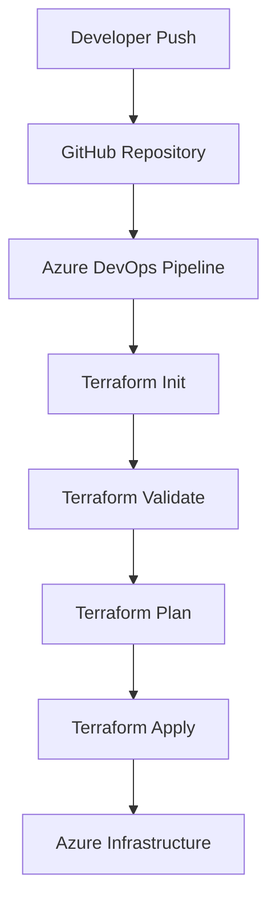

# 🚀 Azure End-to-End Infrastructure Automation using Terraform & Azure DevOps


---

## 📌 Project Overview

This project demonstrates a complete **End-to-End Azure Infrastructure Deployment Pipeline** using **Terraform**, **Azure DevOps**, **GitHub**, and **Infrastructure as Code (IaC)** principles.

The solution automates provisioning, validation, planning, and deployment of Azure resources through Azure DevOps CI/CD pipelines while maintaining Terraform remote state in Azure Storage Accounts.

### Key Objectives

* Automate Azure infrastructure provisioning
* Implement Infrastructure as Code (IaC)
* Configure CI/CD pipelines using Azure DevOps
* Manage Terraform state remotely
* Follow enterprise DevOps best practices

---

## 🏗️ Architecture

```text
Developer
    │
    ▼
GitHub Repository
    │
    ▼
Azure DevOps Pipeline
    │
    ├── Terraform Init
    ├── Terraform Validate
    ├── Terraform Plan
    └── Terraform Apply
    │
    ▼
Azure Subscription
    │
    ├── Resource Group
    ├── Virtual Network
    ├── Storage Account
    ├── Virtual Machines
    └── Supporting Resources
```

---

## ✨ Features

✅ Infrastructure as Code using Terraform

✅ Azure DevOps CI/CD Automation

✅ Terraform Remote State Management

✅ Automated Validation & Planning

✅ Environment-Based Deployments

✅ Reusable Terraform Configuration

✅ Azure Service Connection Integration

✅ Enterprise-Ready Project Structure

---

## 🛠️ Technology Stack

| Technology            | Purpose                |
| --------------------- | ---------------------- |
| Azure Cloud           | Infrastructure Hosting |
| Terraform             | Infrastructure as Code |
| Azure DevOps          | CI/CD Automation       |
| GitHub                | Source Control         |
| Azure CLI             | Azure Authentication   |
| Azure Storage Account | Terraform Backend      |
| YAML Pipelines        | Deployment Automation  |

---

## 📂 Project Structure

```bash
Azure_End_To_END/
│
├── backend.tf
├── provider.tf
├── main.tf
├── variables.tf
├── outputs.tf
│
├── azure-pipelines.yml
│
└── README.md
```

---

## 🔄 CI/CD Workflow

### 1. Code Commit

Developer pushes code to GitHub.

### 2. Pipeline Trigger

Azure DevOps automatically triggers the pipeline.

### 3. Terraform Init

```bash
terraform init
```

Downloads providers and configures backend.

### 4. Terraform Validate

```bash
terraform validate
```

Validates Terraform configuration.

### 5. Terraform Plan

```bash
terraform plan
```

Generates execution plan.

### 6. Terraform Apply

```bash
terraform apply -auto-approve
```

Deploys Azure infrastructure.

---

## 🔐 Terraform Remote Backend

Terraform state is stored securely in Azure Storage Account.

### Example Backend Configuration

```hcl
terraform {
  backend "azurerm" {
    resource_group_name  = "terraform-state-rg"
    storage_account_name = "tfstateaccount"
    container_name       = "tfstate"
    key                  = "terraform.tfstate"
  }
}
```

### Benefits

* Centralized State Management
* Team Collaboration
* State Locking
* Improved Security
* Version Control

---

## 🚀 Getting Started

### Clone Repository

```bash
git clone https://github.com/Mehrunnisa786/Azure_End_To_END.git

cd Azure_End_To_END
```

### Login to Azure

```bash
az login
```

### Initialize Terraform

```bash
terraform init
```

### Validate Configuration

```bash
terraform validate
```

### Generate Plan

```bash
terraform plan
```

### Deploy Infrastructure

```bash
terraform apply
```

### Destroy Infrastructure

```bash
terraform destroy
```

---

## 🔧 Azure DevOps Configuration

### Create Azure Service Connection

1. Azure DevOps
2. Project Settings
3. Service Connections
4. Azure Resource Manager
5. Grant access permission to all pipelines

### Configure Pipeline Variables

```text
ARM_CLIENT_ID
ARM_CLIENT_SECRET
ARM_SUBSCRIPTION_ID
ARM_TENANT_ID
```

Store secrets securely in:

```text
Azure DevOps Library → Variable Groups
```

---

## 📊 Project Workflow



---

## 📚 Learning Outcomes

This project helped gain hands-on experience with:

* Terraform Fundamentals
* Azure Infrastructure Deployment
* Remote State Management
* Azure DevOps Pipelines
* CI/CD Automation
* Infrastructure as Code Best Practices
* Enterprise Cloud Deployment Workflows

---

## 👩‍💻 Author

### Mehrunnisa Afrah

**DevOps Engineer | Azure | Terraform | Kubernetes | CI/CD**

GitHub: https://github.com/Mehrunnisa786

LinkedIn: Add your LinkedIn profile here

---

## ⭐ Support

If you found this project useful:

⭐ Star the repository

🍴 Fork the repository

📢 Share it with the DevOps community

---

## 📄 License

This project is licensed under the MIT License.
