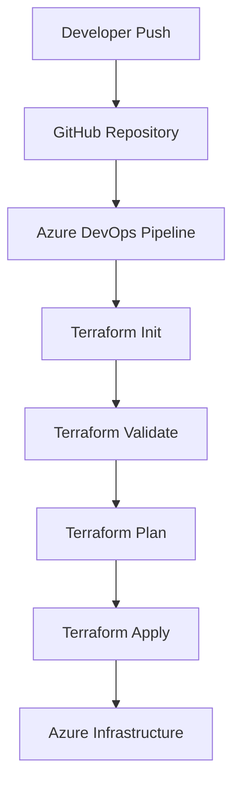

# Terraform End-to-End: Azure DevOps CI/CD for AKS, Key Vault & Service Principal

A multi-stage Azure DevOps pipeline that provisions Azure infrastructure — AKS clusters, Key Vault, and Service Principals — across **dev** and **staging** environments using Terraform, with remote state management, RBAC-based access control, and a separate manual-approval destroy pipeline for safe environment teardown.

## Pipeline Run


## Destroy Pipeline — Approval Gate

![Destroy pipeline paused for manual approval]  


*The destroy pipeline runs `plan_destroy` automatically to preview what would be removed, then pauses at `destroy_env`, requiring explicit manual approval via an Azure DevOps Environment check before any infrastructure is torn down.*


*Three-stage pipeline — Terraform validate, Dev deploy, and Staging deploy — completing successfully end-to-end.*

## What This Project Does

This repo provisions, per environment (dev/staging):

- **Resource Group** — isolated per environment
- **Azure AD Application + Service Principal** — created dynamically via Terraform, used for AKS cluster authentication
- **Azure Key Vault** (RBAC-authorization enabled) — stores the Service Principal's client secret
- **AKS Cluster** — with autoscaling node pool, OIDC issuer enabled, and SSH access configured for node debugging
- **Role Assignments**:
  - Service Principal granted **Contributor** at subscription scope
  - Pipeline identity granted **Key Vault Secrets Officer** on the vault (required because the vault uses RBAC authorization, not legacy access policies)

State is stored remotely in **Azure Blob Storage**, with separate state files per environment to prevent cross-environment interference.

## Architecture

```
end-to-end-project/all-code/
├── dev/
│   ├── main.tf
│   ├── variables.tf
│   ├── backend.tf
│   └── terraform.tfvars
├── staging/
│   ├── main.tf
│   ├── variables.tf
│   ├── backend.tf
│   └── terraform.tfvars
└── modules/
    ├── ServicePrincipal/
    ├── keyvault/
    └── aks/
```

## Pipelines

### 1. `azure-pipelines.yml` — Deploy Pipeline
Triggers automatically on push to `main` (when changes touch `end-to-end-project/all-code/**`).

**Stages:**
1. **validate** — `terraform init` + `terraform validate` against dev config
2. **Dev_deploy** — `terraform apply` to dev environment
3. **stage_deploy** — `terraform apply` to staging environment

### 2. `azure-pipelines-destroy.yml` — Destroy Pipeline
Manually triggered only (`trigger: none`), with an `environment` parameter (`dev` / `stage`).

**Stages:**
1. **plan_destroy** — runs `terraform plan -destroy` automatically, showing exactly what would be removed
2. **destroy_env** — gated behind an **Azure DevOps Environment approval** — a human must manually approve before `terraform destroy --auto-approve` executes

This two-step plan-then-approve-then-destroy flow prevents accidental infrastructure deletion.

## Key Engineering Decisions & Problems Solved

Building this pipeline surfaced a number of real-world Terraform + Azure DevOps issues, each resolved deliberately:

- **YAML indentation correctness** — Azure Pipelines YAML is strict about indentation; debugged several malformed pipeline definitions that silently failed to parse.
- **Interactive variable prompts in CI** — `var.ssh_public_key` had no default, causing the pipeline to hang indefinitely waiting for input that would never come in a non-interactive CI agent. Fixed by injecting the value via `TF_VAR_ssh_public_key` as a pipeline variable, keeping the key out of source control.
- **State lock recovery** — handled `Error acquiring the state lock` scenarios caused by cancelled/interrupted runs, using both Azure Portal lease-breaking and `az storage blob lease break` via CLI.
- **Globally unique resource naming** — caught and fixed a Key Vault name collision (`VaultAlreadyExists`) caused by template/placeholder values left in `terraform.tfvars`.
- **Immutable Azure resource settings** — resolved an `OIDCIssuerFeatureCannotBeDisabled` error by aligning Terraform config with the AKS cluster's actual deployed state (OIDC issuer cannot be disabled once enabled).
- **RBAC vs. legacy Key Vault access models** — diagnosed a `403 Forbidden / ForbiddenByRbac` error caused by the pipeline's identity lacking explicit RBAC permissions on a Key Vault using `enable_rbac_authorization = true`; added an explicit `Key Vault Secrets Officer` role assignment scoped to the vault.
- **State drift from local vs. pipeline identity** — discovered that running Terraform locally under a personal Azure AD identity (vs. the pipeline's service connection identity) caused `data.azurerm_client_config.current` to resolve differently, which would have triggered unintended ownership changes to the Service Principal and Key Vault role assignments. Resolved by using `terraform import` only (never `apply`) for local state reconciliation, and verifying via the pipeline as the source of truth.
- **Safe teardown design** — built a separate destroy pipeline with a plan-preview stage and a manual approval gate (via Azure DevOps Environments) before any destructive action runs.

## Tech Stack

- **Terraform** (1.15.x) — infrastructure as code
- **Azure DevOps Pipelines** — YAML-based multi-stage CI/CD
- **Azure providers**: `azurerm`, `azuread`, `tls`, `local`
- **Azure services**: AKS, Key Vault, Resource Groups, Azure AD App Registrations/Service Principals, Blob Storage (remote state)

## Notes

- The pipeline currently uses client secret authentication for the service connection; migrating to **Workload Identity Federation** is a planned improvement (flagged by Azure DevOps as a deprecation warning, non-blocking).
- SSH keys for AKS node access are injected via pipeline variables and never committed to source control.# 🚀 Azure End-to-End Infrastructure Automation using Terraform & Azure DevOps


---

## 📌 Project Overview

This project demonstrates a complete **End-to-End Azure Infrastructure Deployment Pipeline** using **Terraform**, **Azure DevOps**, **GitHub**, and **Infrastructure as Code (IaC)** principles.

The solution automates provisioning, validation, planning, and deployment of Azure resources through Azure DevOps CI/CD pipelines while maintaining Terraform remote state in Azure Storage Accounts.

### Key Objectives

* Automate Azure infrastructure provisioning
* Implement Infrastructure as Code (IaC)
* Configure CI/CD pipelines using Azure DevOps
* Manage Terraform state remotely
* Follow enterprise DevOps best practices

---

## 🏗️ Architecture

```text
Developer
    │
    ▼
GitHub Repository
    │
    ▼
Azure DevOps Pipeline
    │
    ├── Terraform Init
    ├── Terraform Validate
    ├── Terraform Plan
    └── Terraform Apply
    │
    ▼
Azure Subscription
    │
    ├── Resource Group
    ├── Virtual Network
    ├── Storage Account
    ├── Virtual Machines
    └── Supporting Resources
```

---

## ✨ Features

✅ Infrastructure as Code using Terraform

✅ Azure DevOps CI/CD Automation

✅ Terraform Remote State Management

✅ Automated Validation & Planning

✅ Environment-Based Deployments

✅ Reusable Terraform Configuration

✅ Azure Service Connection Integration

✅ Enterprise-Ready Project Structure

---

## 🛠️ Technology Stack

| Technology            | Purpose                |
| --------------------- | ---------------------- |
| Azure Cloud           | Infrastructure Hosting |
| Terraform             | Infrastructure as Code |
| Azure DevOps          | CI/CD Automation       |
| GitHub                | Source Control         |
| Azure CLI             | Azure Authentication   |
| Azure Storage Account | Terraform Backend      |
| YAML Pipelines        | Deployment Automation  |

---

## 📂 Project Structure

```bash
Azure_End_To_END/
│
├── backend.tf
├── provider.tf
├── main.tf
├── variables.tf
├── outputs.tf
│
├── azure-pipelines.yml
│
└── README.md
```

---

## 🔄 CI/CD Workflow

### 1. Code Commit

Developer pushes code to GitHub.

### 2. Pipeline Trigger

Azure DevOps automatically triggers the pipeline.

### 3. Terraform Init

```bash
terraform init
```

Downloads providers and configures backend.

### 4. Terraform Validate

```bash
terraform validate
```

Validates Terraform configuration.

### 5. Terraform Plan

```bash
terraform plan
```

Generates execution plan.

### 6. Terraform Apply

```bash
terraform apply -auto-approve
```

Deploys Azure infrastructure.

---

## 🔐 Terraform Remote Backend

Terraform state is stored securely in Azure Storage Account.

### Example Backend Configuration

```hcl
terraform {
  backend "azurerm" {
    resource_group_name  = "terraform-state-rg"
    storage_account_name = "tfstateaccount"
    container_name       = "tfstate"
    key                  = "terraform.tfstate"
  }
}
```

### Benefits

* Centralized State Management
* Team Collaboration
* State Locking
* Improved Security
* Version Control

---

## 🚀 Getting Started

### Clone Repository

```bash
git clone https://github.com/Mehrunnisa786/Azure_End_To_END.git

cd Azure_End_To_END
```

### Login to Azure

```bash
az login
```

### Initialize Terraform

```bash
terraform init
```

### Validate Configuration

```bash
terraform validate
```

### Generate Plan

```bash
terraform plan
```

### Deploy Infrastructure

```bash
terraform apply
```

### Destroy Infrastructure

```bash
terraform destroy
```

---

## 🔧 Azure DevOps Configuration

### Create Azure Service Connection

1. Azure DevOps
2. Project Settings
3. Service Connections
4. Azure Resource Manager
5. Grant access permission to all pipelines

### Configure Pipeline Variables

```text
ARM_CLIENT_ID
ARM_CLIENT_SECRET
ARM_SUBSCRIPTION_ID
ARM_TENANT_ID
```

Store secrets securely in:

```text
Azure DevOps Library → Variable Groups
```

---

## 📊 Project Workflow



---

## 📚 Learning Outcomes

This project helped gain hands-on experience with:

* Terraform Fundamentals
* Azure Infrastructure Deployment
* Remote State Management
* Azure DevOps Pipelines
* CI/CD Automation
* Infrastructure as Code Best Practices
* Enterprise Cloud Deployment Workflows

---

## 👩‍💻 Author

### Mehrunnisa Afrah

**DevOps Engineer | Azure | Terraform | Kubernetes | CI/CD**

GitHub: https://github.com/Mehrunnisa786

LinkedIn: Add your LinkedIn profile here

---

## ⭐ Support

If you found this project useful:

⭐ Star the repository

🍴 Fork the repository

📢 Share it with the DevOps community

---

## 📄 License

This project is licensed under the MIT License.
